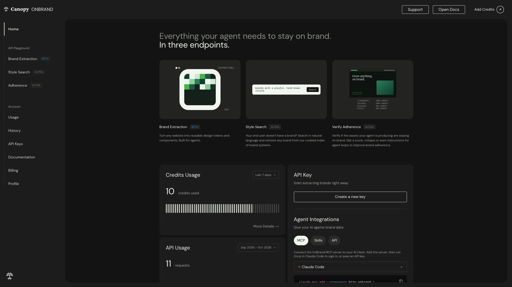
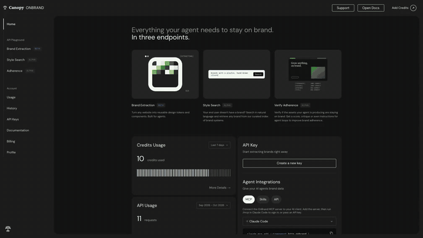
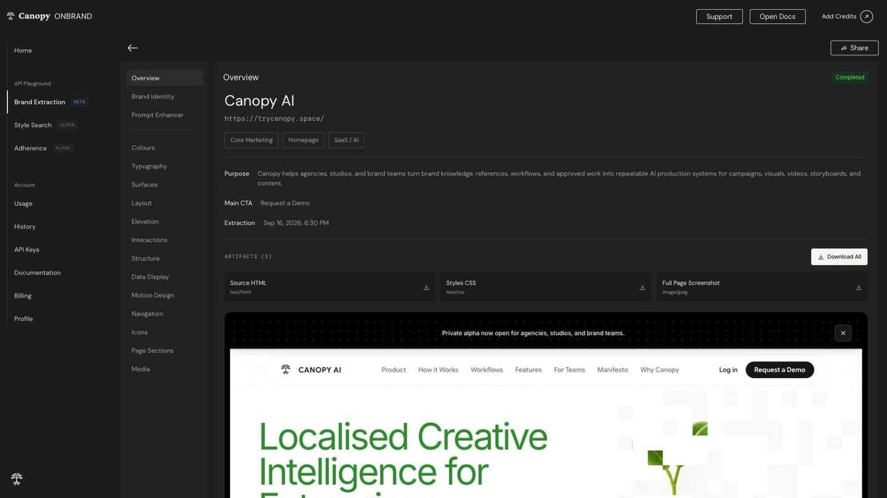
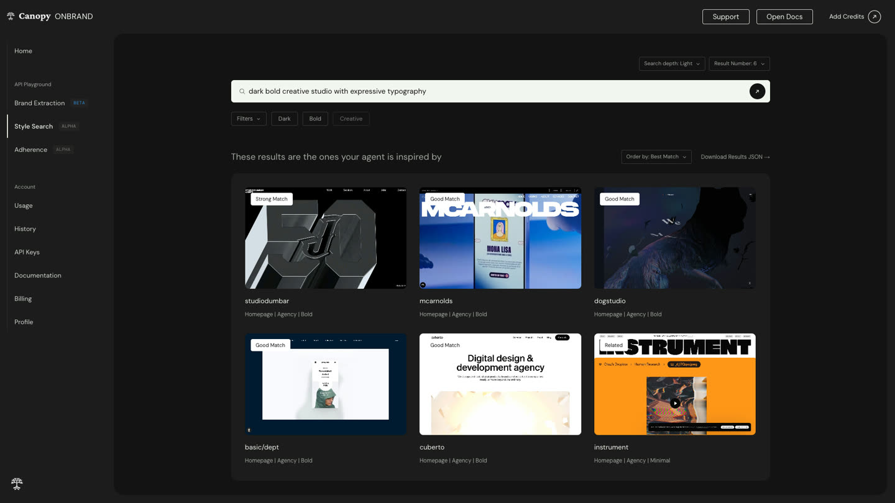
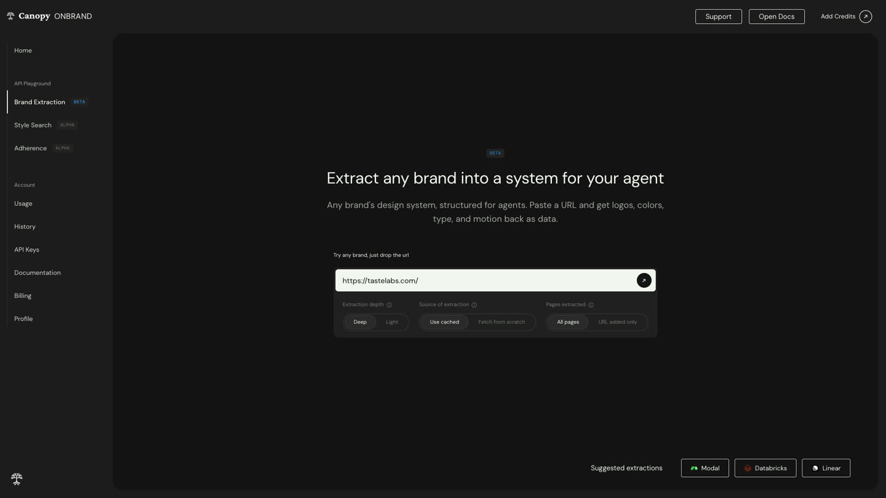
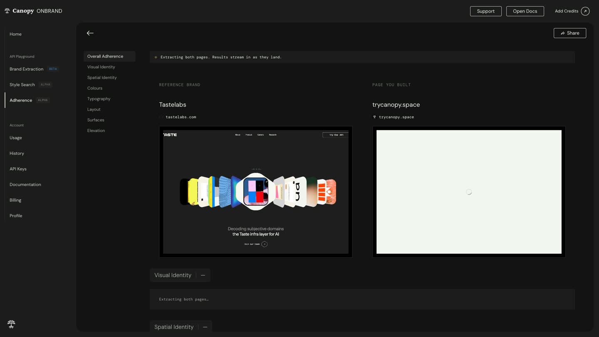

# OnBrand API

**A brand system that AI agents can use.** OnBrand extracts structured design systems from websites, searches for brands by visual direction, and checks whether a page follows a reference brand. Use it from the dashboard, REST API, MCP server, agent skill, or TypeScript SDK.

<p align="center">
  
</p>

<p align="center"><em>Dashboard screenshot from the application.</em></p>

<p align="center">
  
</p>

<p align="center"><em>A short montage made from real application screenshots (not a live browser recording). <a href="docs/media/onbrand-walkthrough.mp4">Open or download the MP4 walkthrough</a>.</em></p>

## Product tour

| Extract a brand system | Search by visual direction |
| --- | --- |
|  |  |

| Start an extraction | Compare a design with a reference |
| --- | --- |
|  |  |

The adherence image shows the comparison flow in progress; it is not presented as a completed score. More screens and an interactive system map are available in [`docs/architecture/`](docs/architecture/), and the current UI scorecard is in [`docs/PARITY.md`](docs/PARITY.md).

## Capabilities

- **Brand extraction:** turn a public website into structured identity, color, typography, surface, layout, elevation, interaction, navigation, icon, media, and page-section data. Return design tokens and captured artifacts such as HTML, CSS, and screenshots.
- **Style search:** find systems in the curated index with a natural-language description; deeper search adds model-based reranking and explanations.
- **Adherence checks:** compare a design with its reference across visual categories and return actionable suggestions for an iteration loop.
- **Agent interfaces:** access the same product through the REST API, MCP, an installable skill, or the TypeScript SDK.
- **Dashboard:** manage jobs, inspect extracted systems, search, compare designs, and manage API access.

## API overview

The production service is [`brand.trycanopy.space`](https://brand.trycanopy.space). API requests use an API key in the `Authorization: Bearer` header.

| Method and path | Purpose |
| --- | --- |
| `POST /api/v1/extract` | Start or wait for a website brand extraction |
| `POST /api/v1/search` | Search indexed brand systems by style prompt |
| `POST /api/v1/adherence` | Compare a reference and a designed page |
| `GET /api/health` | Check web/API and database health |
| `GET /openapi.json` | OpenAPI document |
| `/api/mcp` | MCP endpoint for agent clients |

Jobs and extracted resources also have API routes; see the generated OpenAPI document or the dashboard's `/app/docs` for the complete, current schema.

Example request:

```bash
curl -X POST https://brand.trycanopy.space/api/v1/extract \
  -H "Authorization: Bearer $ONBRAND_API_KEY" \
  -H "Content-Type: application/json" \
  -d '{"url":"https://linear.app"}'
```

For predictable agent flows, start an asynchronous request and poll its job/resource endpoint, or use the SDK's wait option. Check the OpenAPI schema for exact request fields and response shape; API contracts evolve with the deployed version.

## TypeScript SDK

```bash
npm install @canopylabs/onbrand
```

```ts
import { OnBrand } from "@canopylabs/onbrand";

const onbrand = new OnBrand({ apiKey: process.env.ONBRAND_API_KEY! });

const brand = await onbrand.extract({ url: "https://linear.app", wait: true });
const report = await onbrand.verify({
  reference: "https://linear.app",
  design: "https://my-build.example",
  wait: true,
});
```

Keep API keys on the server or in the agent runtime's secret store—never embed them in browser code or commit them.

## MCP and agent skill

Register the remote MCP server with an Authorization header:

```bash
claude mcp add --transport http onbrand https://brand.trycanopy.space/api/mcp \
  --header "Authorization: Bearer $ONBRAND_API_KEY"
```

Install the repository's agent skill with:

```bash
npx skills add PrateekDevashetti/OnBrand-API
```

## Architecture

```text
apps/web        Next.js UI, REST API and MCP endpoint                 → Vercel
apps/worker     Playwright-backed background job worker               → Railway
packages/core   crawler, signal collection, synthesis, search, scoring,
                queue, storage, database and evaluation tools
packages/sdk    @canopylabs/onbrand TypeScript client
skills/onbrand  agent skill and workflow guidance
qa/             API/SDK checks and visual parity tooling
```

During extraction, headless Chromium renders and scrolls the target page. A collector samples computed styles and page structure; analysis groups the measured signals into tokens and sections. Where configured, structured model synthesis enriches the measured result. Jobs are claimed from Postgres by the worker, and artifacts are stored in S3-compatible object storage. Style search uses the curated index; adherence combines measurable comparisons with generated critique.

The detailed diagrams are available as [system architecture](docs/architecture/architecture-onbrand-20261006-130500/onbrand-architecture.html) and [extraction sequence](docs/architecture/sequence-extraction-20261006-131500/onbrand-extraction-sequence.html).

## Run locally

Requirements: Node.js 20+, npm, PostgreSQL, and a Chromium installation supported by the pinned Playwright version.

```bash
cp .env.example .env
# Set DATABASE_URL; add model and storage credentials for those integrations.
npm install
npx -y playwright@1.63.0 install chromium
npm run db:push
npm run dev
```

The web app runs at [http://localhost:3100](http://localhost:3100). For the separate job worker, use another terminal and run `npm run dev:worker`. `npm run db:seed` populates the curated style-search index and may crawl external websites. Local auth settings are intended for development only.

Useful commands:

| Command | Purpose |
| --- | --- |
| `npm run dev` | Start the web app and API |
| `npm run dev:worker` | Start the background worker |
| `npm run build` | Build configured workspaces |
| `npm run typecheck` | Type-check the workspaces |
| `npm run db:push` | Apply the current database schema |
| `npm run db:seed` | Build/populate the curated search index |
| `npm run eval -w @onbrand/core` | Run extraction and adherence evaluations |
| `npm run e2e` | Run the configured end-to-end suite |

## Deployment

The web app is deployed to Vercel with `apps/web` as its root directory. The worker runs on Railway from the repository's Docker image and Railway Infrastructure-as-Code configuration under `.railway/`. Production also uses Neon Postgres, R2-compatible object storage, Clerk, and configured model access.

For a release, deploy a preview, verify its health/API behavior, then promote the verified deployment. Configure production secrets in the platform—not in source control. Worker environment variables must be represented in `.railway/railway.ts`; review `railway config plan` before applying infrastructure changes. See [`docs/PENDING.md`](docs/PENDING.md) for current operational state and launch decisions.

## Development and verification

Run the focused checks relevant to your change. For API behavior, use the API smoke suite; for extraction quality, use the core evaluation command; for UI changes, use the parity harness and end-to-end suite. A passing unit or build check is not by itself proof of a successful authenticated production workflow. Record exactly which checks ran and against which environment.

## Contributing

Keep API and SDK contracts aligned, preserve tenant isolation and job idempotency, and add regression coverage for behavior changes. For UI changes, attach updated screenshots where useful. Never commit credentials, private customer pages, or captured customer content.

## Status and licensing

OnBrand is in private alpha. The operational handoff, known follow-ups, and deployment notes are in [`docs/PENDING.md`](docs/PENDING.md); authentication and billing launch decisions are called out there. No open-source license is currently declared; contact Canopy Labs before reusing this project.
